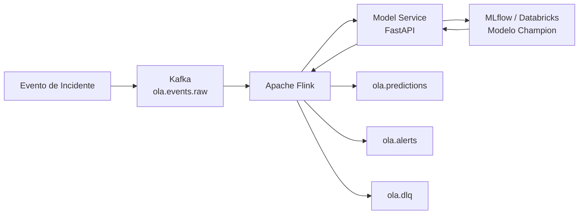

# Streaming OLA - Predição de Violação de KPI

Projeto de arquitetura de dados em streaming para predição de risco de violação de KPI em incidentes de TI.

A solução utiliza **Apache Kafka**, **Apache Flink**, **FastAPI**, **MLflow**, **Databricks** e **Docker** para processar eventos em tempo real e realizar inferência com um modelo de Machine Learning.

---

## Objetivo

Criar um fluxo de streaming capaz de receber eventos de incidentes, processá-los em tempo real e calcular a probabilidade de violação de KPI.

Quando a probabilidade ultrapassa o limite definido, o evento pode ser direcionado para um tópico de alertas.

---

## Arquitetura



Fluxo principal:

```text
Kafka
  ↓
Apache Flink
  ↓
Model Service
  ↓
MLflow / Databricks
  ↓
Modelo de Machine Learning
  ↓
Apache Flink
  ↓
Kafka
```

---

## Tecnologias

- Apache Kafka
- Apache Flink / PyFlink
- Docker / Docker Compose
- Python
- FastAPI
- MLflow
- Databricks
- Scikit-learn

---

## Tópicos Kafka

| Tópico | Função |
|---|---|
| `ola.events.raw` | Entrada dos eventos |
| `ola.predictions` | Resultado das previsões |
| `ola.alerts` | Eventos classificados como alerta |
| `ola.dlq` | Eventos com erro de processamento |

---

## Modelo de Machine Learning

O modelo foi treinado no Databricks e registrado no MLflow / Unity Catalog.

```text
fiap_analytics.ml.previsao_kpi_gbm@champion
```

O Apache Flink envia os dados para um serviço FastAPI, responsável por carregar o modelo e executar a inferência.

---

## Resultado

A arquitetura foi validada ponta a ponta com sucesso.

Exemplo de previsão:

```text
Incidente:                  INC_STREAM_001

Probabilidade de violação:  31,57%
Threshold de alerta:        89,58%
Alerta:                     False
```

O resultado foi publicado no tópico:

```text
ola.predictions
```

Fluxo validado:

```text
Kafka
  ↓
Flink
  ↓
Model Service
  ↓
MLflow
  ↓
Modelo Champion
  ↓
Flink
  ↓
Kafka
```

---

## Estrutura do Projeto

```text
streaming-ola/
│
├── docker-compose.yml
│
├── flink/
│   ├── Dockerfile
│   └── jobs/
│       └── ola_streaming.py
│
├── model-service/
│   ├── Dockerfile
│   ├── requirements.txt
│   └── app.py
│
└── README.md
```

---

## Status

```text
Kafka                         ✅
Apache Flink                  ✅
Model Service                 ✅
MLflow / Databricks           ✅
Inferência em tempo real      ✅
Pipeline ponta a ponta        ✅
```
